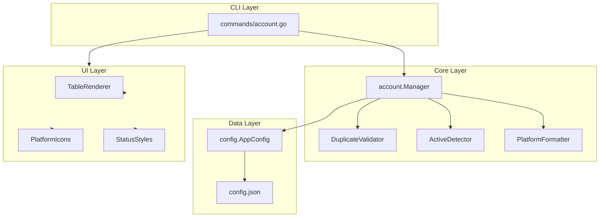

# Design Document: Account Management Enhancement

## Overview

Dokumen ini menjelaskan desain teknis untuk penyempurnaan fitur manajemen akun pada GHEX. Fokus utama adalah meningkatkan tampilan daftar akun, deteksi akun aktif yang lebih akurat, validasi duplikasi yang komprehensif, dan dukungan multi-platform yang konsisten.

## Architecture



## Components and Interfaces

### 1. DuplicateValidator

Komponen baru untuk validasi duplikasi akun.

```go
// DuplicateValidator validates account uniqueness
type DuplicateValidator struct {
    accounts []config.Account
}

// ValidationResult contains duplicate check results
type ValidationResult struct {
    IsValid     bool
    Errors      []string  // Hard errors (must fix)
    Warnings    []string  // Soft warnings (can proceed)
}

// ValidateNew checks if a new account would create duplicates
func (v *DuplicateValidator) ValidateNew(account config.Account) ValidationResult

// CheckNameDuplicate checks for duplicate account names (case-insensitive)
func (v *DuplicateValidator) CheckNameDuplicate(name string) bool

// CheckEmailDuplicate checks for duplicate email on same platform
func (v *DuplicateValidator) CheckEmailDuplicate(email, platform string) *config.Account

// CheckSSHKeyDuplicate checks if SSH key is already used
func (v *DuplicateValidator) CheckSSHKeyDuplicate(keyPath string) *config.Account

// CheckTokenDuplicate checks for duplicate token username on same platform
func (v *DuplicateValidator) CheckTokenDuplicate(username, platform string) *config.Account
```

### 2. Enhanced ActiveDetector

Penyempurnaan deteksi akun aktif dengan scoring system.

```go
// MatchScore represents how well an account matches current context
type MatchScore struct {
    AccountName   string
    Score         int
    MatchedFields []string
}

// DetectActiveWithScore returns the best matching account with confidence score
func (m *Manager) DetectActiveWithScore(repoPath string) (*MatchScore, error)

// Scoring weights:
// - Git user.name match: 30 points
// - Git user.email match: 30 points  
// - SSH key in use: 20 points
// - Platform match: 20 points
```

### 3. PlatformFormatter

Komponen untuk formatting platform-specific display.

```go
// PlatformInfo contains display information for a platform
type PlatformInfo struct {
    Type   string
    Icon   string
    Name   string
    Domain string
}

// GetPlatformInfo returns display info for a platform type
func GetPlatformInfo(platformType string) PlatformInfo

// Platform icons mapping:
// - github: 🐙
// - gitlab: 🦊
// - bitbucket: 🪣
// - gitea: 🍵
// - other: 🔗
```

### 4. Enhanced TableRenderer

Komponen UI untuk rendering tabel akun yang lebih informatif.

```go
// AccountTableRow represents a single row in the account table
type AccountTableRow struct {
    Status       string  // Active indicator
    Name         string
    Platform     string  // With icon
    GitIdentity  string  // name <email>
    AuthMethods  string  // SSH/Token indicators
    Health       string  // Health status
}

// RenderAccountTable renders accounts in a formatted table
func RenderAccountTable(accounts []config.Account, activeAccount string) string
```

## Data Models

### Enhanced Account Display Model

```go
// AccountDisplayInfo contains all information needed to display an account
type AccountDisplayInfo struct {
    Account       config.Account
    IsActive      bool
    MatchScore    int
    HealthStatus  *HealthIndicators
    PlatformInfo  PlatformInfo
}

// HealthIndicators contains health check indicators
type HealthIndicators struct {
    SSHKeyExists  bool
    SSHKeyValid   *bool  // nil = unknown
    TokenValid    *bool  // nil = unknown
    LastChecked   time.Time
    IsStale       bool   // true if > 24 hours old
}
```

### Validation Error Types

```go
// DuplicateError represents a duplicate validation error
type DuplicateError struct {
    Field           string  // "name", "email", "ssh_key", "token"
    Value           string
    ConflictAccount string
    IsSoftWarning   bool
}
```


## Correctness Properties

*A property is a characteristic or behavior that should hold true across all valid executions of a system-essentially, a formal statement about what the system should do. Properties serve as the bridge between human-readable specifications and machine-verifiable correctness guarantees.*

### Property 1: Account Table Rendering Completeness
*For any* list of accounts, the rendered table output SHALL contain all required columns (status, name, platform, git identity, authentication methods) for each account.
**Validates: Requirements 1.1**

### Property 2: Platform Icon Mapping Consistency
*For any* valid platform type (github, gitlab, bitbucket, gitea, other), the GetPlatformInfo function SHALL return the correct corresponding icon.
**Validates: Requirements 1.2**

### Property 3: Dual Authentication Display
*For any* account that has both SSH and Token configurations, the rendered display SHALL show both authentication method indicators.
**Validates: Requirements 1.3**

### Property 4: Active Account Indicator Presence
*For any* account marked as active, the rendered output SHALL contain the active indicator (✓ ACTIVE).
**Validates: Requirements 2.1**

### Property 5: Active Account Detection Accuracy
*For any* account and git configuration where user.name and user.email match the account's git identity, the DetectActiveWithScore function SHALL return that account with a positive match score.
**Validates: Requirements 2.2**

### Property 6: Name Uniqueness Enforcement
*For any* existing account name (case-insensitive), attempting to add a new account with the same name SHALL result in a validation error.
**Validates: Requirements 3.1**

### Property 7: Email Duplicate Warning
*For any* email and platform combination that already exists in the account list, attempting to add another account with the same combination SHALL produce a warning.
**Validates: Requirements 3.2**

### Property 8: SSH Key Duplicate Warning
*For any* SSH key path that is already associated with an existing account, attempting to add another account with the same key path SHALL produce a warning.
**Validates: Requirements 3.3**

### Property 9: Token Username Duplicate Warning
*For any* token username and platform combination that already exists, attempting to add another account with the same combination SHALL produce a warning.
**Validates: Requirements 3.4**

### Property 10: Case-Insensitive Comparison
*For any* two strings that differ only in letter case, the duplicate validation SHALL treat them as equal.
**Validates: Requirements 3.5**

### Property 11: Platform URL Format Correctness
*For any* platform type and repository information, the generated SSH host and remote URL SHALL follow the correct format specification for that platform.
**Validates: Requirements 4.3, 4.5**

### Property 12: Platform Detection from URL
*For any* remote URL, the platform detection function SHALL correctly identify the platform type based on the URL domain.
**Validates: Requirements 4.4**

### Property 13: Health Indicator Correctness
*For any* SSH key or token validity state (valid, invalid, unknown), the health indicator display SHALL show the correct symbol (✓, ✗, ?).
**Validates: Requirements 5.1, 5.2**

### Property 14: Stale Health Data Detection
*For any* health check timestamp older than 24 hours, the IsStale field SHALL be true.
**Validates: Requirements 5.4**

### Property 15: Account Configuration Round-Trip
*For any* valid Account object, serializing to JSON and then deserializing SHALL produce an equivalent Account object with all fields preserved.
**Validates: Requirements 6.1, 6.2, 6.3, 6.5**

### Property 16: Graceful Optional Field Handling
*For any* valid JSON configuration with missing optional fields (SSH, Token, Platform), deserialization SHALL succeed and populate default values.
**Validates: Requirements 6.4**

## Error Handling

### Validation Errors

| Error Type | Condition | Response |
|------------|-----------|----------|
| DuplicateNameError | Account name already exists | Reject addition, display error message |
| DuplicateEmailWarning | Email exists on same platform | Display warning, allow proceed |
| DuplicateSSHKeyWarning | SSH key path already in use | Display warning, allow proceed |
| DuplicateTokenWarning | Token username exists on platform | Display warning, allow proceed |

### Configuration Errors

| Error Type | Condition | Response |
|------------|-----------|----------|
| ConfigNotFoundError | Config file doesn't exist | Create default config |
| ConfigParseError | Invalid JSON in config | Display error, suggest fix |
| ConfigWriteError | Cannot write to config file | Display error with path |

### Detection Errors

| Error Type | Condition | Response |
|------------|-----------|----------|
| NotGitRepoError | Not in a git repository | Skip active detection, show all accounts |
| NoRemoteError | No remote configured | Use git identity only for matching |
| SSHKeyNotFoundError | SSH key file missing | Show warning indicator |

## Testing Strategy

### Property-Based Testing

Menggunakan library `github.com/leanovate/gopter` untuk property-based testing di Go.

**Test Configuration:**
- Minimum 100 iterations per property test
- Custom generators untuk Account, Platform, dan ValidationResult types

**Property Tests to Implement:**

1. **Serialization Round-Trip Test**
   - Generate random Account objects
   - Serialize to JSON, deserialize back
   - Verify equality
   - Tag: `**Feature: account-management-enhancement, Property 15: Account Configuration Round-Trip**`

2. **Duplicate Validation Test**
   - Generate random account lists and new accounts
   - Verify name uniqueness is enforced
   - Tag: `**Feature: account-management-enhancement, Property 6: Name Uniqueness Enforcement**`

3. **Case-Insensitive Comparison Test**
   - Generate random strings with case variations
   - Verify case-insensitive matching works
   - Tag: `**Feature: account-management-enhancement, Property 10: Case-Insensitive Comparison**`

4. **Platform Icon Mapping Test**
   - For all platform types, verify correct icon returned
   - Tag: `**Feature: account-management-enhancement, Property 2: Platform Icon Mapping Consistency**`

5. **Health Indicator Test**
   - Generate random health states
   - Verify correct indicator symbols
   - Tag: `**Feature: account-management-enhancement, Property 13: Health Indicator Correctness**`

6. **Stale Detection Test**
   - Generate random timestamps
   - Verify stale detection for timestamps > 24 hours
   - Tag: `**Feature: account-management-enhancement, Property 14: Stale Health Data Detection**`

### Unit Tests

1. **Table Rendering Tests**
   - Test empty account list displays help message
   - Test single account rendering
   - Test multiple accounts with active indicator

2. **Active Detection Tests**
   - Test detection in git repository
   - Test detection outside git repository
   - Test no matching account scenario

3. **Platform URL Tests**
   - Test SSH URL generation for each platform
   - Test HTTPS URL generation for each platform
   - Test custom domain handling

### Integration Tests

1. **Config Persistence Test**
   - Add account, save, reload, verify
   - Modify account, save, reload, verify

2. **Duplicate Prevention Test**
   - Add account, attempt duplicate, verify rejection
