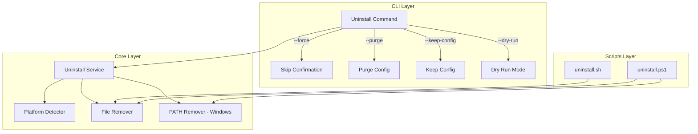

# Design Document: GHEX Uninstall Feature

## Overview

Fitur uninstall menyediakan cara yang bersih dan aman untuk menghapus GHEX dari sistem pengguna. Fitur ini terdiri dari dua komponen utama:
1. Command `ghex uninstall` yang terintegrasi dalam CLI
2. Standalone uninstall scripts untuk kasus binary rusak atau tidak dapat diakses

Fitur ini mendukung cross-platform (Linux, macOS, Windows) dengan penanganan path dan permission yang sesuai untuk setiap platform.

## Architecture



## Components and Interfaces

### 1. Uninstall Command (`cmd/ghex/commands/uninstall.go`)

```go
type UninstallOptions struct {
    Force      bool   // Skip confirmation prompt
    Purge      bool   // Remove config files
    KeepConfig bool   // Explicitly keep config files
    DryRun     bool   // Preview without removing
}
```

Command flags:
- `--force, -f`: Skip confirmation prompt
- `--purge`: Remove binary and all configuration files
- `--keep-config`: Remove only binary, preserve config
- `--dry-run`: Show what would be removed without removing

### 2. Uninstall Service (`internal/uninstall/uninstall.go`)

```go
type UninstallService interface {
    // GetBinaryPath returns the path to the installed binary
    GetBinaryPath() (string, error)
    
    // GetConfigPath returns the path to the config directory
    GetConfigPath() string
    
    // Preview returns list of files/dirs that would be removed
    Preview() (*UninstallPreview, error)
    
    // Execute performs the uninstallation
    Execute(opts UninstallOptions) (*UninstallResult, error)
    
    // RemoveBinary removes the GHEX binary
    RemoveBinary() error
    
    // RemoveConfig removes the config directory
    RemoveConfig() error
    
    // RemoveFromPath removes install dir from PATH (Windows only)
    RemoveFromPath() error
}

type UninstallPreview struct {
    BinaryPath    string
    ConfigPath    string
    PathEntry     string   // Windows only
    FilesToRemove []string
}

type UninstallResult struct {
    BinaryRemoved  bool
    ConfigRemoved  bool
    PathUpdated    bool
    RemovedFiles   []string
    Errors         []error
}
```

### 3. Platform-Specific Paths

| Platform | Binary Path | Config Path |
|----------|-------------|-------------|
| Linux/macOS | `/usr/local/bin/ghex` | `~/.config/ghe/` |
| Windows | `%LOCALAPPDATA%\ghex\ghex.exe` | `%APPDATA%\ghe\` |

## Data Models

### UninstallOptions
```go
type UninstallOptions struct {
    Force      bool
    Purge      bool
    KeepConfig bool
    DryRun     bool
}
```

### UninstallPreview
```go
type UninstallPreview struct {
    BinaryPath    string   `json:"binary_path"`
    ConfigPath    string   `json:"config_path"`
    PathEntry     string   `json:"path_entry,omitempty"`
    FilesToRemove []string `json:"files_to_remove"`
}
```

### UninstallResult
```go
type UninstallResult struct {
    Success       bool     `json:"success"`
    BinaryRemoved bool     `json:"binary_removed"`
    ConfigRemoved bool     `json:"config_removed"`
    PathUpdated   bool     `json:"path_updated"`
    RemovedFiles  []string `json:"removed_files"`
    Errors        []string `json:"errors,omitempty"`
}
```

## Correctness Properties

*A property is a characteristic or behavior that should hold true across all valid executions of a system-essentially, a formal statement about what the system should do. Properties serve as the bridge between human-readable specifications and machine-verifiable correctness guarantees.*

### Property 1: Binary removal on confirmed uninstall
*For any* confirmed uninstallation (either via prompt confirmation or --force flag), the GHEX binary file SHALL no longer exist at the install path after execution completes.
**Validates: Requirements 1.2**

### Property 2: Purge removes both binary and config
*For any* uninstallation with --purge flag, both the binary path AND the config directory SHALL no longer exist after execution completes.
**Validates: Requirements 2.2**

### Property 3: Keep-config preserves configuration
*For any* uninstallation with --keep-config flag, the config directory SHALL still exist after execution completes, while the binary SHALL be removed.
**Validates: Requirements 2.3**

### Property 4: Platform-specific binary path (Unix)
*For any* execution on Linux or macOS, the binary path returned by GetBinaryPath() SHALL be `/usr/local/bin/ghex`.
**Validates: Requirements 3.1**

### Property 5: Platform-specific binary path (Windows)
*For any* execution on Windows, the binary path returned by GetBinaryPath() SHALL be within `%LOCALAPPDATA%\ghex\`.
**Validates: Requirements 3.2**

### Property 6: Dry-run preserves filesystem state
*For any* uninstallation with --dry-run flag, the filesystem state (existence of binary and config) SHALL be identical before and after execution.
**Validates: Requirements 5.1, 5.3**

### Property 7: Dry-run output completeness
*For any* dry-run execution, the preview output SHALL contain the binary path and config path.
**Validates: Requirements 5.2**

## Error Handling

### Permission Errors
- Jika binary tidak dapat dihapus karena permission, tampilkan pesan error dengan instruksi:
  - Linux/macOS: `sudo rm /usr/local/bin/ghex`
  - Windows: Run as Administrator atau manual delete

### File Not Found
- Jika binary tidak ditemukan, tampilkan warning tapi lanjutkan dengan config removal jika diminta

### PATH Modification Errors (Windows)
- Jika PATH tidak dapat dimodifikasi, tampilkan instruksi manual untuk menghapus entry dari Environment Variables

### Error Messages Format
```
[ERROR] Cannot remove binary: permission denied
        Run with elevated privileges or manually remove:
        sudo rm /usr/local/bin/ghex
```

## Testing Strategy

### Unit Testing
- Test `GetBinaryPath()` returns correct path per platform
- Test `GetConfigPath()` returns correct path per platform
- Test `Preview()` returns complete information
- Test flag parsing and option handling

### Property-Based Testing
Library: `github.com/leanovate/gopter` (Go property-based testing library)

Setiap property test harus:
- Menjalankan minimal 100 iterasi
- Di-tag dengan format: `**Feature: uninstall-feature, Property {number}: {property_text}**`
- Mereferensikan correctness property dari design document

Property tests akan memverifikasi:
1. Binary removal consistency
2. Config preservation with --keep-config
3. Dry-run filesystem invariant
4. Platform path correctness

### Integration Testing
- Test full uninstall flow dengan temporary directories
- Test script execution pada masing-masing platform
- Test error handling dengan simulated permission errors
